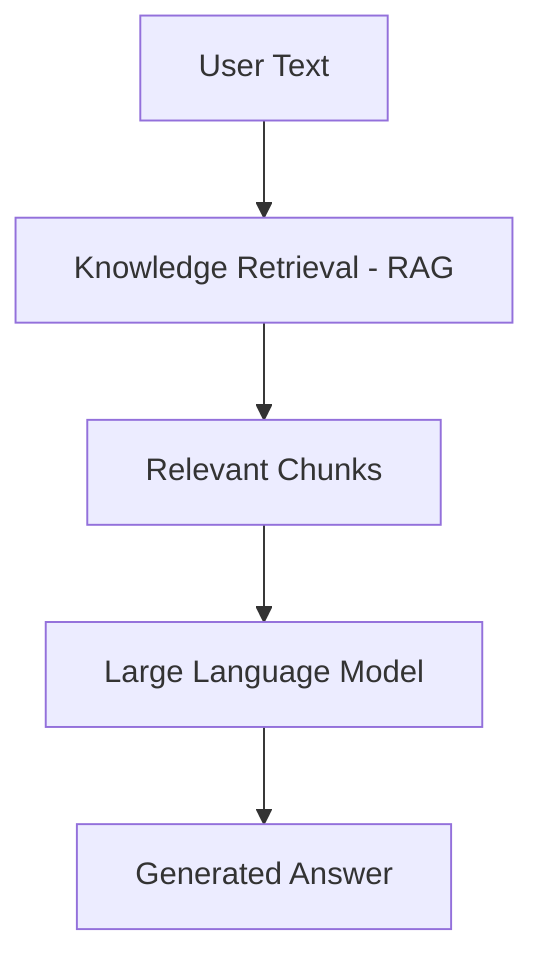
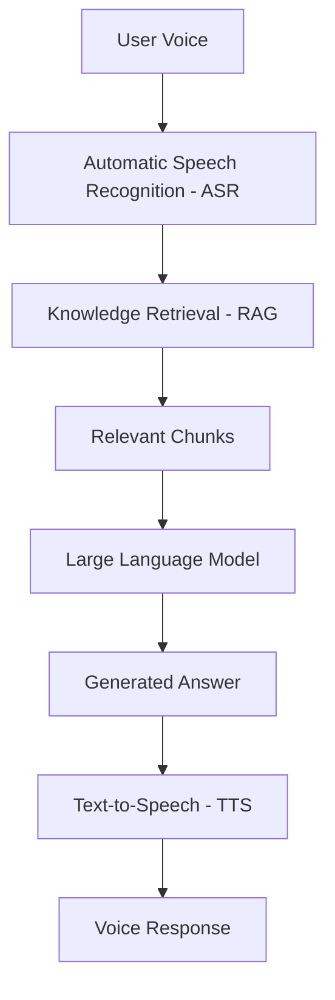
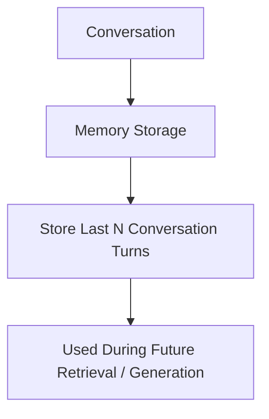

# 🤖 AI Intelligent Assistant (Arabic / English)

An AI-powered intelligent assistant that supports **Arabic and English** through both **text and voice interactions**. It combines Automatic Speech Recognition (ASR), Retrieval-Augmented Generation (RAG), a Large Language Model (LLM), Text-to-Speech (TTS) with voice cloning, and conversational memory to deliver fast, context-aware, and natural responses.

The included example knowledge base is built around **Telecom Egypt ("WE")** customer support content (scraped FAQ/website pages), making the assistant a working demo of an enterprise, bilingual, voice-enabled support agent — though the pipeline itself is domain-agnostic and can be pointed at any document set.

---

## 📖 Table of Contents

- [🤖 AI Intelligent Assistant (Arabic / English)](#-ai-intelligent-assistant-arabic--english)
  - [📖 Table of Contents](#-table-of-contents)
  - [🚀 Features](#-features)
  - [🏗️ System Architecture](#️-system-architecture)
    - [1. Text Pipeline](#1-text-pipeline)
    - [2. Voice Pipeline](#2-voice-pipeline)
    - [3. Conversation Memory](#3-conversation-memory)
  - [🧩 Models Used](#-models-used)
    - [1. Automatic Speech Recognition (ASR)](#1-automatic-speech-recognition-asr)
    - [2. Retrieval (RAG — Embedding Model)](#2-retrieval-rag--embedding-model)
    - [3. Large Language Model (LLM)](#3-large-language-model-llm)
    - [4. Text-to-Speech (TTS)](#4-text-to-speech-tts)
  - [🕷️ Data Collection: Scraping te.eg](#️-data-collection-scraping-teeg)
    - [Crawling](#crawling)
    - [Cleaning \& Semantic Chunking](#cleaning--semantic-chunking)
  - [🧠 Core Technologies / Tech Stack](#-core-technologies--tech-stack)
  - [📁 Project Structure](#-project-structure)
  - [⚙️ Installation](#️-installation)
  - [🔑 Configuration](#-configuration)
    - [Hugging Face Authentication](#hugging-face-authentication)
    - [Orchestrator Parameters](#orchestrator-parameters)
  - [▶️ Running the Project](#️-running-the-project)
  - [💬 Example Usage](#-example-usage)
  - [🌍 Supported Languages](#-supported-languages)
  - [📌 Use Cases](#-use-cases)
  - [📊 Performance / Evaluation](#-performance--evaluation)
  - [⚠️ Limitations](#️-limitations)
  - [🔮 Future Improvements](#-future-improvements)
  - [🤝 Contributing](#-contributing)
  - [📄 License](#-license)
  - [🙏 Acknowledgments](#-acknowledgments)
  - [📝 Suggested Additions](#-suggested-additions)

---

## 🚀 Features

| Feature | Description |
|---|---|
| 🎤 Voice Analytics | Real-time Arabic and English ASR for speech transcription |
| 📚 Knowledge Retrieval | Instant retrieval of relevant documents and FAQs using RAG |
| 🧠 Intelligent Agent | Context-aware LLM for intelligent customer interactions |
| 🗣️ Voice Synthesis | Natural Arabic and English Text-to-Speech responses, using **voice cloning** from a reference audio sample |
| 📊 Analytics Dashboard | Real-time metrics and insights |
| 💾 Conversation Memory | Stores recent conversation turns for contextual, multi-turn responses |

---

## 🏗️ System Architecture

### 1. Text Pipeline



### 2. Voice Pipeline



### 3. Conversation Memory



The assistant keeps a rolling window of recent conversation turns (question + answer pairs) and feeds them back into the LLM as chat history, so follow-up questions stay context-aware.

---

## 🧩 Models Used

The pipeline is built from four specialized open-source models, orchestrated by `Orchestration/orchestrator.py`.

### 1. Automatic Speech Recognition (ASR)

| | |
|---|---|
| **Models** | [`NAMAA-Space/cohere-transcribe-arabic-07-2026-int4`](https://huggingface.co/NAMAA-Space/cohere-transcribe-arabic-07-2026-int4) (transcription) + [Faster-Whisper](https://github.com/SYSTRAN/faster-whisper) (language detection) |
| **Purpose** | Detects the spoken language, then converts speech into text for the RAG/LLM pipeline |
| **Input** | Raw audio (`.wav`/`.mp3`) |
| **Output** | Detected language (`ar`/`en`) + transcribed text |
| **How it works** | `ASR.detect_language()` runs a Faster-Whisper model over the audio to decide whether it's Arabic or English. The audio is then passed to the NAMAA Cohere Arabic ASR model (loaded via `transformers`' `AutoProcessor` / `CohereAsrForConditionalGeneration`) for transcription |
| **Optimization** | The transcription model is loaded in its **INT4-quantized** form, reducing memory footprint — useful on a single T4 GPU |

> ⚠️ **Note on discrepancy:** the model list you provided names `openai/whisper-tiny` specifically, but in the code (`ASR/asr_model.py`), the language-detection step uses **Faster-Whisper** with a configurable `model_name` that **defaults to `"base"`**, not `"tiny"`. If you intend to use `whisper-tiny`, pass `asr_model_name="tiny"` when constructing `Orchestrator`/`ASR` — otherwise the README should say `"base"` (Faster-Whisper) rather than `whisper-tiny`. Let me know which is correct so I can lock this section in.

### 2. Retrieval (RAG — Embedding Model)

| | |
|---|---|
| **Model** | [`BAAI/bge-m3`](https://huggingface.co/BAAI/bge-m3), via the [`FlagEmbedding`](https://github.com/FlagOpen/FlagEmbedding) `BGEM3FlagModel` |
| **Purpose** | Generates dense vector embeddings for documents and user queries to power semantic search over the knowledge base |
| **Input** | Text (documents/FAQ chunks at indexing time; user queries at inference time) |
| **Output** | Dense vector embeddings, compared via dot-product similarity |
| **Why this model** | `bge-m3` is a multilingual embedding model with native Arabic/English support, matching this project's bilingual retrieval needs |
| **Config** | `use_fp16=True` (on CUDA), `batch_size=16`, `max_length=8192` tokens, `top_k=5` by default (the Gradio app overrides this to `top_k=10`) |
| **Vector store** | A lightweight **in-memory store** (`WebsiteStore` / `UploadedStore` in `RAG/Retriever/`) — embeddings are held as PyTorch tensors and searched via dot-product + `torch.topk`. No external vector database (e.g., FAISS/Chroma) is used |

### 3. Large Language Model (LLM)

| | |
|---|---|
| **Model** | [`meta-llama/Llama-3.2-1B-Instruct`](https://huggingface.co/meta-llama/Llama-3.2-1B-Instruct) |
| **Purpose** | Generates the final answer from the user's question, retrieved context chunks, and recent conversation history |
| **Input** | Question + retrieved context chunks + chat history |
| **Output** | Natural language answer (Arabic or English) |
| **Why this model** | A compact, instruction-tuned 1B-parameter model — small enough to run alongside ASR/TTS on a single T4 GPU |
| **Config** | Loaded via a Hugging Face `transformers` `pipeline("text-generation", ...)` with `torch_dtype=torch.float16`, `temperature=0.0` (deterministic/greedy decoding) by default, and `max_new_tokens=512` |
| **System prompt** | Instructs the model to act as a support assistant for **Telecom Egypt (WE)**, answer strictly from the provided context, and say when the answer isn't in the knowledge base |

> Note: your original model list said `meta-llama/Llama-3.2-1B` (base model); the code actually loads the **`-Instruct`** variant, which is what chat-style prompting (via `apply_chat_template`) requires.

### 4. Text-to-Speech (TTS)

| | |
|---|---|
| **Model** | [SILMA Open-Source Arabic/English TTS](https://huggingface.co/blog/silma-ai/opensource-arabic-english-text-to-speech-model) (`silma-tts` Python package, `SilmaTTS` class) |
| **Purpose** | Converts the LLM's generated answer into speech |
| **Input** | Generated answer text + a **reference audio clip and its transcript** |
| **Output** | Synthesized `.wav` audio, cloned to sound like the reference voice |
| **Why this model** | Open-source, bilingual (Arabic/English), and supports **voice cloning** — the assistant speaks in whichever reference voice is supplied, rather than a small set of fixed built-in voices |
| **Reference voice** | The Gradio app (`app_gradio.py`) defaults to `reference_audio.wav` (repo root) with an Arabic reference transcript; `input/Female.wav` and `input/Male.wav` appear to be alternate reference voice samples |

---

## 🕷️ Data Collection: Scraping te.eg

The bundled `documents/` knowledge base is built by crawling **[te.eg](https://te.eg/)** (Telecom Egypt's public website) using `Utils/spidering.py`.

### Crawling

| | |
|---|---|
| **Script** | `Utils/spidering.py` |
| **Seed URLs** | `https://www.te.eg/en/personal`, `https://www.te.eg/ar/personal` |
| **Crawl engine** | LangChain's `RecursiveUrlLoader`, following links up to `MAX_DEPTH = 4` hops from each seed |
| **Scope control** | Only crawls `te.eg` / `www.te.eg` (`ALLOWED_NETLOCS`) — login-walled subdomains like `my.te.eg`, `billing.te.eg`, and `shop.te.eg` are skipped since they're transactional SPAs, not scrapable content |
| **Politeness** | Checks `robots.txt` before fetching each URL, uses a descriptive `User-Agent` (`TelecomEgyptKB-Bot/1.0`), and waits `REQUEST_DELAY = 0.5s` between requests |
| **Content extraction** | A custom BeautifulSoup extractor (`extract_clean_text`) removes `<script>`, `<style>`, `<nav>`, `<header>`, `<footer>`, and other boilerplate, then isolates the page's `#main-content` (or `<main>`) region — falling back to boilerplate-stripped `<body>` if neither is found |
| **Output** | One JSON file per page, saved to `documents/`, each containing the page URL, title, detected language (from the `<html lang>` attribute), cleaned text, source (`"te.eg"`), and scrape timestamp |

### Cleaning & Semantic Chunking

Each scraped page is then cleaned and split into chunks before being embedded and loaded into the RAG knowledge base. The processed files in `documents/` record exactly what was done to each page:

- **Cleaning applied:** whitespace removal, Unicode normalization, list-structure preservation, and emoji removal (see the `processing_metadata.cleaning_applied` field in each JSON file)
- **Chunking strategy:** `semantic_boundary_detection_by_section` — text is split along semantic/section boundaries rather than fixed character counts, so each chunk stays topically coherent
- **Chunk overlap:** adjacent chunks retain a small overlapping snippet (`metadata.overlap_with_prev` / `overlap_with_next`) to preserve context across chunk boundaries
- **Per-chunk metadata:** each chunk records its token count, sentence count, extracted topic keywords, and start/end character positions within the source page

Example structure of a processed document (`documents/*.json`):

```json
{
  "original_document": {
    "url": "https://www.te.eg/...",
    "title": "...",
    "lang": "ar-SA",
    "sources": "te.eg",
    "scraped_at": "2026-07-15T22:38:38Z"
  },
  "chunks": [
    {
      "chunk_id": "chunk_001",
      "chunk_index": 0,
      "total_chunks": 2,
      "text": "...",
      "lang": "ar",
      "metadata": {
        "token_count": 195,
        "sentence_count": 9,
        "has_overlap": true,
        "overlap_with_next": "...",
        "topic_keywords": ["..."],
        "start_position": 0,
        "end_position": 760
      }
    }
  ],
  "processing_metadata": {
    "cleaning_applied": ["whitespace_removal", "unicode_normalization", "list_preservation", "emoji_removal"],
    "chunking_strategy": "semantic_boundary_detection_by_section",
    "avg_chunk_size": 116,
    "total_tokens": 233,
    "processing_time": "2026-07-17T14:46:12Z"
  }
}
```

These pre-chunked, pre-cleaned JSON files are what `Orchestrator.add_web_data()` loads at startup — each chunk is embedded with `BAAI/bge-m3` and indexed into the in-memory `WebsiteStore` for retrieval.

> **TODO:** The semantic chunking / cleaning script itself isn't among the files I found in `ASR/`, `RAG/`, `TTS/`, `Orchestration/`, or `Utils/` — only its *output* (the metadata shown above) is visible in `documents/*.json`. If you'd like this section to describe the chunking algorithm itself (e.g., how section boundaries are detected, what determines chunk size), point me to that script and I'll document it precisely rather than inferring from the output alone.

---

## 🧠 Core Technologies / Tech Stack

Based on `requirements.txt` and the imports actually used in the code:

- **ASR:** `faster-whisper`, Hugging Face `transformers` (`CohereAsrForConditionalGeneration`)
- **Retrieval:** `FlagEmbedding` (`bge-m3`), `torch` (in-memory vector search)
- **LLM:** Hugging Face `transformers` (`pipeline`), `torch`
- **TTS:** `silma-tts` (voice cloning)
- **Document ingestion / scraping:** `beautifulsoup4`, `playwright`, `langchain_community`, `unstructured` (for parsing uploaded files)
- **UI:** [Gradio](https://www.gradio.app/) (`app_gradio.py`)
- **Tunneling (Colab):** `pyngrok`
- **Other:** `onnxruntime-gpu`, `accelerate`, `bitsandbytes`, `speechbrain`

**Target hardware:** NVIDIA **T4 GPU**

> ⚠️ **Note:** `requirements.txt` in the repo currently lists `streamlit` and `streamlit-mic-recorder`, but the app entry point (`app_gradio.py`) imports `gradio` — which is **not** in `requirements.txt` (it's only installed via the manual `pip install gradio -q` step below). Similarly, `silma-tts`, `unstructured`, `bitsandbytes`, and `speechbrain` are used by the code but aren't in `requirements.txt` either. You may want to reconcile `requirements.txt` with the manual install commands so `pip install -r requirements.txt` alone is enough to run the app.

---

## 📁 Project Structure

```text
Telecom_Intelligent_Assistant/
├── ASR/
│   └── asr_model.py            # Language detection (Faster-Whisper) + transcription (NAMAA Cohere Arabic ASR)
├── RAG/
│   ├── llm.py                  # LLM wrapper (Llama-3.2-1B-Instruct)
│   ├── memory.py                # ChatMemory - rolling conversation history
│   ├── rag.py                   # RAGSystem - ties embeddings + retrieval + LLM + memory together
│   ├── user_doc.py
│   └── Retriever/
│       ├── embedding_manager.py # BAAI/bge-m3 embedding wrapper
│       ├── retrieval_manager.py # Top-k retrieval across stores
│       ├── uploaded_store.py    # In-memory vector store for user-uploaded docs
│       └── website_store.py     # In-memory vector store for scraped website docs
├── TTS/
│   └── tts_model.py            # SilmaTTS wrapper (voice cloning)
├── Orchestration/
│   └── orchestrator.py         # Wires ASR + RAG + TTS into one pipeline
├── Utils/
│   ├── chunks.py                # Utility to count/inspect chunks in the documents/ JSON files
│   ├── language.py              # Simple regex-based Arabic/English text language detection
│   ├── screenshot.py            # Screenshot capture utility
│   └── spidering.py             # Crawls te.eg and extracts clean page text (see "Data Collection" section)
├── documents/                    # Pre-scraped Telecom Egypt (WE) knowledge base (JSON chunks)
├── input_audios/                 # Sample AR/EN audio for testing
├── outputs/                      # Generated TTS responses (.wav) and saved session data
├── app_gradio.py                 # Gradio web app entry point
├── colab.py                      # Google Colab setup/install script
├── reference_audio.wav           # Default TTS voice-cloning reference audio
├── requirements.txt
└── README.md
```

---

## ⚙️ Installation

Install the required dependencies:

```bash
pip install -r requirements.txt
```

Then install the additional packages the app needs (see note above — these aren't currently in `requirements.txt`):

```bash
pip install -U transformers accelerate
pip install silma-tts --no-deps
pip install silma-tts
pip install unstructured-inference --no-deps
pip install "unstructured[all-local]"
pip install gradio -q
pip install -U bitsandbytes>=0.46.1
pip install speechbrain
```

> **TODO:** Confirm the required Python version.

---

## 🔑 Configuration

### Hugging Face Authentication

Before running the application, log in to your Hugging Face account (required to download the ASR/LLM models):

```python
from huggingface_hub import login

login(token="YOUR_HUGGINGFACE_TOKEN")
```

Replace `YOUR_HUGGINGFACE_TOKEN` with your own [Hugging Face access token](https://huggingface.co/settings/tokens).

### Orchestrator Parameters

`Orchestrator` (in `Orchestration/orchestrator.py`) exposes the key knobs for the whole pipeline:

| Parameter | Default | Description |
|---|---|---|
| `asr_model_name` | `"base"` | Faster-Whisper size used for language detection |
| `asr_compute_type` | `"float32"` | Faster-Whisper compute precision |
| `embedder_model` | `"BAAI/bge-m3"` | Embedding model for retrieval |
| `llm_model` | `"meta-llama/Llama-3.2-1B-Instruct"` | Generation model |
| `max_turns` | `5` | Number of conversation turns kept in memory |
| `top_k` | `5` | Number of chunks retrieved per query (the Gradio app sets this to `10`) |
| `tts_reference_audio` / `tts_reference_text` | `None` | Reference clip/transcript for TTS voice cloning (the Gradio app sets these to `reference_audio.wav` and an Arabic sentence) |
| `max_characters` / `new_after_n_chars` / `overlap` | `1000` / `800` / `100` | Chunking parameters for uploaded documents (via `unstructured`) |

---

## ▶️ Running the Project

```bash
python app_gradio.py
```

When running in **Google Colab**, Gradio will generate a public URL that you can open in your browser to interact with the assistant. (`colab.py` contains the Colab setup steps — mounting Drive and installing dependencies.)

**Hardware requirement:** an NVIDIA **T4 GPU** (e.g., Colab's free/Pro T4 runtime) is recommended for running the ASR, LLM, and TTS models together.

---

## 💬 Example Usage

Sample audio files for testing the voice pipeline are included under `Test/` (`arabic_audio.mp3`, `eng_audio.mp3`), and example screenshots of the app are in `Test/` and `outputs/`.

> **TODO:** Add a short walkthrough or GIF showing a text conversation and a voice conversation end-to-end.

---

## 🌍 Supported Languages

- 🇸🇦 Arabic
- 🇺🇸 English

Supports both:
- 💬 Text conversations
- 🎙️ Voice conversations

---

## 📌 Use Cases

The bundled `documents/` knowledge base is built from scraped **Telecom Egypt (WE)** website content (personal plans, promotions, devices, mobile/fixed services, careers, contact info, etc.), so out of the box this repo demonstrates:

- Telecom customer support (WE-specific FAQs and offers)
- Technical documentation assistant
- FAQ automation
- Voice-enabled AI assistant
- Enterprise knowledge management
- Multilingual conversational AI

The pipeline itself is not telecom-specific — swapping in a different `documents/` set (or uploading files) repurposes it for any knowledge base.

---

## 📊 Performance / Evaluation

> **TODO:** Add benchmarks if available — e.g., ASR word error rate (WER), retrieval accuracy, end-to-end response latency on a T4 GPU, TTS quality/latency.

---

## ⚠️ Limitations

- The LLM is a small 1B-parameter model, which may limit reasoning quality compared to larger models
- The ASR transcription model runs in INT4-quantized form, which trades some accuracy for speed/memory
- Conversation memory is a short rolling window (`max_turns`, default 5) rather than persistent long-term memory
- Retrieval uses a simple in-memory vector store (no persistence across restarts, no approximate-nearest-neighbor indexing for large corpora)
- `requirements.txt` does not currently install everything the app needs (see Tech Stack note above)

> **TODO:** Add any other known limitations (e.g., accuracy on code-switched Arabic/English speech, document upload format support).

---

## 🔮 Future Improvements

> **TODO:** e.g., persistent/long-term memory, a proper vector database (FAISS/Chroma/Qdrant) for scaling retrieval, larger LLM options, streaming responses, implementing the Analytics Dashboard feature, syncing `requirements.txt`.

---

## 🤝 Contributing

> **TODO:** Add contribution guidelines (branching strategy, PR process, code style, issue templates).

---

## 📄 License

> **TODO:** Add the project's license (e.g., MIT, Apache 2.0). Note that the models used carry their own licenses (e.g., Llama 3.2's community license) that govern usage and redistribution.

---

## 🙏 Acknowledgments

- [NAMAA Space](https://huggingface.co/NAMAA-Space) — Arabic ASR model
- [Faster-Whisper](https://github.com/SYSTRAN/faster-whisper) / [OpenAI Whisper](https://huggingface.co/openai/whisper-tiny) — language detection
- [BAAI](https://huggingface.co/BAAI) — `bge-m3` embedding model
- [Meta AI](https://huggingface.co/meta-llama) — Llama 3.2
- [SILMA AI](https://huggingface.co/silma-ai) — Arabic/English TTS with voice cloning
- [Gradio](https://www.gradio.app/) — UI framework
- [Hugging Face](https://huggingface.co/) — model hosting and `transformers`/`accelerate`/`FlagEmbedding` libraries

---

## 📝 Suggested Additions

Open questions and gaps worth resolving before this README is final:

1. **ASR model mismatch** — clarify whether language detection should use `whisper-tiny` (as you specified) or Faster-Whisper `"base"` (as coded).
2. **LLM variant** — confirm `Llama-3.2-1B-Instruct` (used in code) vs. `Llama-3.2-1B` (in your original model list) is the intended model.
3. **`requirements.txt` sync** — reconcile it with the manual `pip install` steps and actual imports (`gradio`, `silma-tts`, `unstructured`, `bitsandbytes`, `speechbrain` are missing; `streamlit`/`streamlit-mic-recorder` appear unused by `app_gradio.py`).
4. **License** — for the repo itself and a note on third-party model licenses.
5. **Example usage** — a walkthrough or screenshots/GIF of a real session (text + voice).
6. **Performance benchmarks** — latency, WER, retrieval accuracy on the T4 GPU.
7. **Analytics Dashboard** — listed as a feature; not obviously implemented in the current file structure — confirm where this lives.
8. **Contributing guidelines**.
9. **Semantic chunking script** — the code that performs the `semantic_boundary_detection_by_section` chunking and cleaning isn't in the repo's Python files; only its output metadata is visible in `documents/*.json`. Adding the script (or confirming it lives outside this repo) would let the Data Collection section describe the algorithm itself.